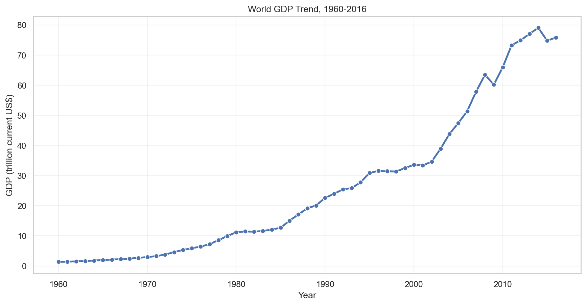
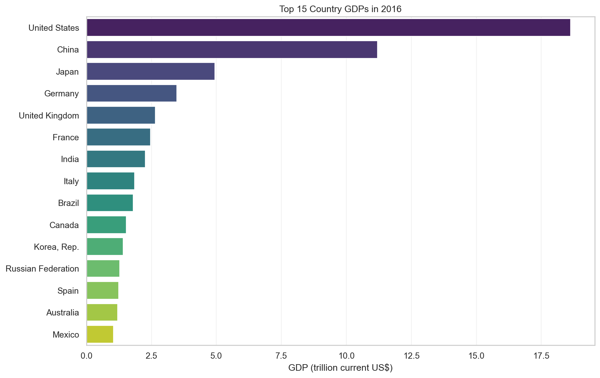
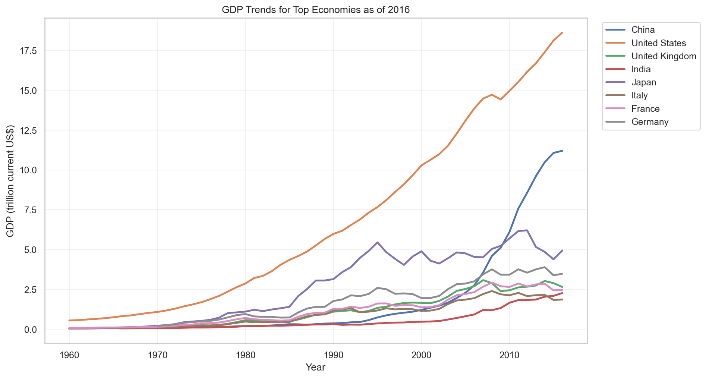
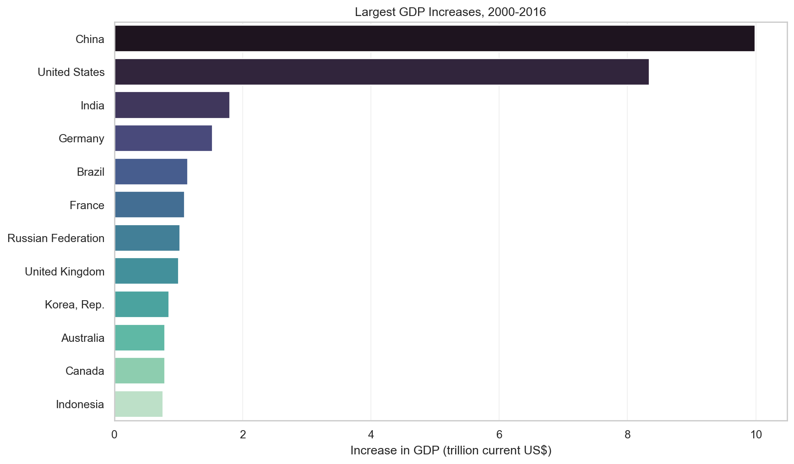
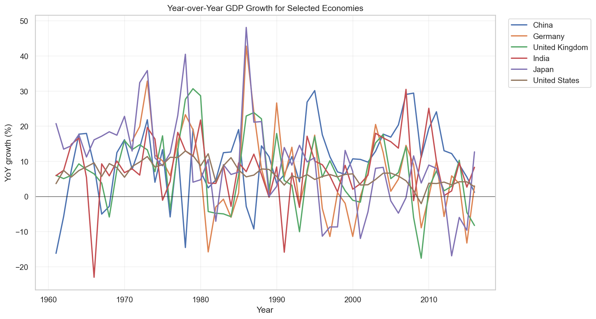
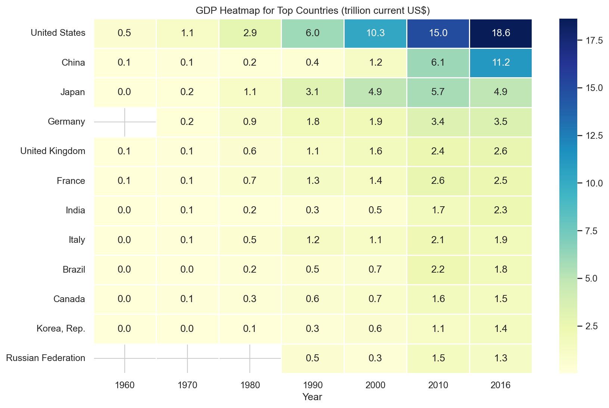

# GDP Analysis and Visualization

This project analyzes a GDP dataset containing country and World Bank aggregate GDP values from 1960 to 2016. It includes a Jupyter notebook for interactive exploration, a reusable Python script for regenerating the analysis, exported plot images, and summary CSV tables.

The goal is to make the dataset easy to understand through clean exploratory analysis and visual storytelling.

## Project Highlights

- Loads and validates GDP data from `gdp.csv`
- Separates country-level records from aggregate groups such as `World`, `High income`, and regional totals
- Identifies the latest available year in the dataset, which is `2016`
- Ranks the top economies by GDP
- Compares GDP trends across major economies
- Calculates the largest GDP increases from 2000 to 2016
- Visualizes year-over-year GDP growth
- Exports all charts as PNG files and key result tables as CSV files

## Dataset

The dataset contains four original columns:

| Column | Description |
| --- | --- |
| `Country Name` | Country, region, or aggregate group name |
| `Country Code` | Three-letter country or aggregate code |
| `Year` | Observation year |
| `Value` | GDP in current US dollars |

Additional derived columns are created during analysis:

| Column | Description |
| --- | --- |
| `GDP Trillion USD` | GDP converted from dollars to trillions of current US dollars |
| `Is Aggregate` | Boolean flag used to separate aggregate groups from individual countries |

## Key Findings

- The dataset has `11,507` rows and `256` unique series.
- The year range is `1960-2016`.
- There are no missing values in the core dataset columns.
- The top country-level GDPs in 2016 are led by the United States, China, Japan, Germany, and the United Kingdom.
- China has the largest absolute GDP increase from 2000 to 2016 among country-level records.
- Rankings exclude aggregate groups so countries are not compared against regions or income categories.

## Visualizations

The generated charts are saved in the `figures/` directory.

### World GDP Trend



### Top 15 Countries by GDP in 2016



### Major Economy GDP Trends



### Largest GDP Increases, 2000-2016



### Year-over-Year GDP Growth



### Top Country GDP Heatmap



## Project Structure

```text
GDP_Analysis/
|-- GDP_Analysis.ipynb
|-- README.md
|-- gdp.csv
|-- gdp_analysis.py
|-- figures/
|   |-- 01_world_gdp_trend.png
|   |-- 02_top_15_countries_latest_year.png
|   |-- 03_major_economy_trends.png
|   |-- 04_largest_gdp_increases_2000_2016.png
|   |-- 05_selected_country_yoy_growth.png
|   `-- 06_top_country_gdp_heatmap.png
`-- summary_tables/
    |-- latest_top_15_countries.csv
    `-- largest_gdp_increases_2000_2016.csv
```

## How to Run

### 1. Install Requirements

This project uses:

- Python 3
- pandas
- matplotlib
- seaborn
- Jupyter Notebook or JupyterLab

Install the required packages:

```bash
pip install pandas matplotlib seaborn notebook
```

### 2. Open the Notebook

For an interactive walkthrough, open:

```bash
jupyter notebook GDP_Analysis.ipynb
```

The notebook includes data loading, quality checks, visualizations, and key takeaways.

## Outputs

### Figures

| File | Description |
| --- | --- |
| `01_world_gdp_trend.png` | Global GDP trend over time |
| `02_top_15_countries_latest_year.png` | Top 15 country-level GDPs in 2016 |
| `03_major_economy_trends.png` | GDP trends for the largest economies |
| `04_largest_gdp_increases_2000_2016.png` | Countries with the largest absolute GDP growth |
| `05_selected_country_yoy_growth.png` | Year-over-year GDP growth for selected economies |
| `06_top_country_gdp_heatmap.png` | Heatmap of GDP levels across selected years |

### Summary Tables

| File | Description |
| --- | --- |
| `latest_top_15_countries.csv` | Top 15 countries by GDP in the latest dataset year |
| `largest_gdp_increases_2000_2016.csv` | Largest country-level GDP increases from 2000 to 2016 |

## Notes

- GDP values are measured in current US dollars.
- Because the dataset includes aggregate groups, country-level rankings use only non-aggregate records.
- The latest year available in this dataset is `2016`; the project does not claim to represent current GDP rankings.

## Author

Created as a data analysis and visualization project for exploring global GDP patterns.
